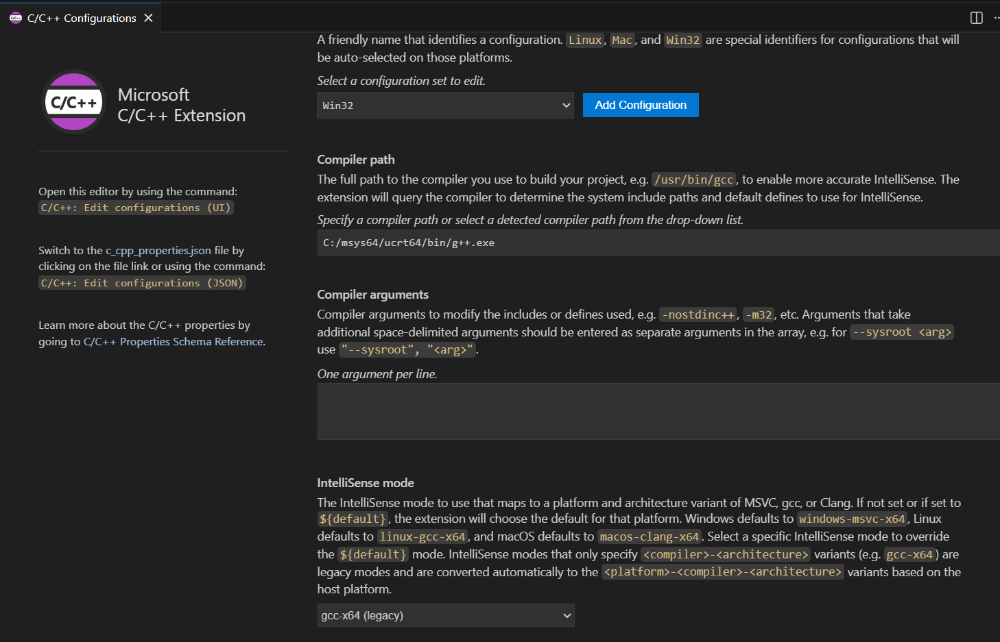

# CP_Setup — Quick Guide

## Prerequisites
- VS Code
- MinGW/GCC for Windows
- C/C++ extension for VS Code

## Install C++
Follow the official guide: https://code.visualstudio.com/docs/cpp/config-mingw

## VS Code setup
- Create a .vscode folder in your project and add tasks.json and launch.json (copy from templates or repo).
- Use problem.cpp as a starting template.
- Use input.txt / output.txt in the project root for sample I/O.

### Making VS Code c++ intellisense compatible to use your mingw compiler

Your code would run fine, but vs code would give you red errors, saying bits/stdc++.h not found.

VS Code IntelliSense configuration issue — not a compilation/runtime error.
Your compiler can see bits/stdc++.h, but IntelliSense cannot, so it shows the squiggly red underlines.

✅ Why this happens

bits/stdc++.h is a non-standard GCC header.

VS Code’s IntelliSense (powered by MSVC by default) does not include it.

You are compiling with MinGW/Clang (which does include it), so the code runs fine.

✅ How to fix the IntelliSense error (most reliable)

You need to tell VS Code's C/C++ extension to use your MinGW compiler and its include paths.

Open Command Palette → Ctrl+Shift+P

Type: C/C++: Edit Configurations (UI)

Set: (compiler path your g++ extension and intellisense mode also if its not compatible, change c++ version if you want)

Note: This should add a c_cpp_properties.json in your .vscode file! 

## Running
- Build/run: Ctrl+Shift+B
- Debug: F5

That's it — minimal setup to compile, run, and debug C++ for competitive programming.